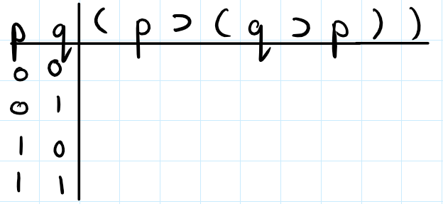

# Truth Tables

## How to Fill Out a Truth Table

You may be asked to provide and fill out the truth table for a given formula. In what follows, I provide steps as to how to do this. Note that I do this in a painstakingly detailed way. Your answers do not have go step-by-step in the way I have outlined here; just the final truth table is fine. In any case, make sure you understand why I take each step that I take. 

1. First, look at the formula and identify the distinct propositional letters in the formula. Knowing how many propositional letters there are and which ones there are will tell you how to fill out the left-hand side of your table. For example, if you have the formula $((p \supset q) \lor (q \lor \sim p))$ then there are only two distinct propositional letters $p$ and $q$. If you have the formula $((q \lor j) \& (j \equiv r))$, there are three distinct propositional letters $q$, $j$, and $r$. 

2. With the propositional letters you have identified in step 1., you will start the left hand side of your truth table with those letters. You will then put the formula you want to do the truth table for to the right of those letters. So, suppose that you have a formula $(p \supset (q \supset p))$ with letters $p$ and $q$, you will start it as follows:

If instead, you have the formula $((r \lor w) \& (\sim j \supset u))$, then you will start your table as follows:

3. Next, you fill out the columns for the propositional letters on the left hand side. To do this, you follow a pattern. 

First, you determine the number of rows that you need to fill out. For $n$ different propositional letters, you will have $2^n$ rows. For example, if you have $2$ propositional letters, then you will have $2^2 = 4$ rows. If you have $3$ propositional letters, then you will have $2^3 = 8$ rows.

Secondly, starting from the right most propositional letter, you fill out the column by alternating 0s and 1s for each row (this is where figuring out how many rows there are comes in handy; for example, if you know that there will be $8$ rows, then you will alternate until you have filled out all $8$ rows). Then you move to the propositional letter one column to the left and you alternate 00 and 11 down the column (you will stop here if you only have two propositional letters). Here is an example:

If you have more than two propositional letters, move one column to the left and you alternate 0000 and 1111 down the column (you will stop here if you only have three propositional letters). Here is an example:

If you have more than three propositional letters, then move one column to the left and you alternate 00000000 and 11111111 down the column (you will stop here if you only have four propositional letters). I leave it to you to continue the pattern.

4. Now, you can start filling out the columns under the formula that you are concerned with. My advice is to just fill out whatever columns you *can* fill out. This will require you to know how the formulas compose together to form bigger formulas. Here is an example (slightly different from the one I covered in person, in discussion): consider the formula $(p \lor j) \& (\sim p \supset \sim (j \equiv p))$. We start off the table as follows:

Now, we look at the propositional connectives and see which ones we can start to evaluate. Let us consider the $\&$ connective. Can we evaluate that one yet? Well, we could only evaluate the $\&$ if we knew the truth value columns of the two formulas that it binds. In this case, the $\&$ binds together the $(p \lor j)$ and the $(\sim p \supset \sim (j \equiv p))$. Do we currently know what the truth value columns for those formulas are? No. The truth value column of $(p\lor j)$ would be the column under the $\lor$ as the $\lor$ binds together the $p$ and the $j$ to create $(p \lor j)$. Can we figure it out? Yes, since we already have the truth value columns for $p$ and $j$:

So, the left conjunct of the $\&$ is taken care of. We now need to find the truth value column of the right conjunct. In this case, the column is the one under the $\supset$ symbol. This is because to form $(\sim p \supset \sim (j \equiv p))$, the $\supset$ symbol binds together the $\sim p$ and the $\sim (j \equiv p)$ formulas. Do we have the truth values of $\sim p$ and $\sim (j \equiv p)$? No. Can we figure it out? Well, we can quickly fill out the $\sim p$ since we know the truth value column of $p$:

Can we do this for $\sim (j \equiv p)$? No. To determine the truth value column under the $\sim$, we need to first know the truth value column under the $\equiv$ in $(j \equiv p)$. Thankfully, we can find that since we already have the truth values of $j$ and $p$:

Now, we can figure out the truth value column under the $\sim$. I have highlighted in magenta-red(?), the column that the negation $\sim$ operates over:

Now, remember that the $\supset$ binded together the $\sim p$ formula and the $\sim (j \equiv p)$. The blue highlighted columns are the truth value columns for those formulas and we have both of them now. So we can evaluate the conditional:

Finally, remember that the $\&$ binded together the $(p \lor j)$ formula and the $(\sim p \supset \sim (j \equiv p))$ formula. The highlighted green columns are the truth value columns for those two formulas. Hence, we can now evaluate the $\&$, which I will highlight in yellow:

That yellow column is the truth value column for the entire formula.

## Definitions of Tautology, Contradiction and Contingency

The concepts of tautology, contradiction, and contingency are really important in logic. Sometimes, just by looking at a formula you may be able to tell whether or not it is a tautology, contradiction or contingency, but sometimes you will not be able to. Thankfully, truth tables are one way to always tell whether or not a formula is one of these three.

So, given a formula, to ascertain whether or not it is a tautology, contradiction or a contingency, you:

1. Fill out its truth table.
2. Look at the truth value column for the formula that you are concerned with. If the column is all 1s then it is a *tautology*. If the column is all 0s then its a *contradiction*. If the column includes at least one 1 and at least one 0 then it is a *contingency*.

That is all there is to it. Informally, a tautology is a formula which is always true; a contradiction is a formula which is always false; and a contingency is a formula which is sometimes true and sometimes false.

## Checking Validity of Arguments with a Truth Table

Sometimes you will be asked to check the validity of an argument using a truth table. The question will often look like "is $\phi_1,\phi_2,\ldots,\phi_n \therefore \psi$ valid?" (the $\phi_1,\phi_2,\ldots,\phi_n,\psi$ just stand for arbitrary formulas). The formulas before the $\therefore$ are the premises and the formula after the $\therefore$ is the conclusion. The procedure for answering such questions is an extension of how to fill out the truth table of a given formula:

1. First look across all the formulas $\phi_1,\phi_2,\ldots,\phi_n, \psi$ and look at all the distinct propositional letters in those formulas. Start off the left hand side of your truth table with those propositional letters (this is just like the first step for "How to Fill out a Truth Table"; the only exception is now you are looking at letters across multiple formulas). Next, put the premises $\phi_1,\ldots,\phi_n,\psi$ to the right of the propositional letters with a line in between each of them. You will end up with something looking like:

(This is a case with two premises $\phi_1$, $\phi_2$ and the conclusion $\psi$). Next, you fill out the columns for the propositional letters on the left-hand side of the table as you would normally (as in, do the same as step 3. for "How to Fill Out a Truth Table").

2. Then, working with only one formula at a time, fill out the truth table. For example, if you are working on $\phi_1$, then you just fill out that truth table; you do not need to consider the other formulas at all. You should end up with truth value columns for all of the formulas (i.e., the premises and the conclusion).

3. To evaluate validity, start from the top row and see whether or not it is a row in which the truth value of every premise is a 1. If it is a row in which all the premises are 1, then check whether or not the conclusion is also a 1. If it is *not*, then the argument is invalid and you can stop checking. If it is a 1 then you move onto the row below and repeat the checking procedure. If there is no row below, then you are done and the argument is valid.

## Practice Problems

Provide the truth table for the following (I omit A3, since it is too easy):

- (A1) $(p \lor q) \lor r$
- (A2) $\sim (p \& q)$
- (A4) $(\sim p \lor \sim q)$
- (A5) $((p \supset q) \equiv (\sim p \lor q))$

Is the following formula a tautology, contradiction or a contingency? Use a truth table to evaluate:

- (B1) $(p \supset p)$
- (B2) $(p \supset \sim\sim p)$
- (B3) $(p \& q) \lor (q \& p)$
- (B4) $\sim (p \supset (q \supset p))$
- (B5) $((q \supset p) \supset (\sim q \supset \sim p))$
- (B6) $((p \supset ((p \supset q) \equiv (p \& \sim r))) \lor r)$

Which of the following arguments are valid?

- (C1) $(\sim p \lor q), q \therefore \sim p$
- (C2) $(\sim p \supset (q \lor p)), \sim p \therefore q$
- (C3) $(p \equiv (q \& \sim p)), (q\supset p) \therefore (q \lor p)$

## Solutions

Under the main column you should have (left-to-right = top-to-bottom)

- (A1) $01111111$
- (A2) $1110$
- (A4) $1110$
- (A5) $1111$

Then for the other questions, I just give the answers you should arrive at (I also quickly did these so there is a possibility of a mistake):

- (B1) Tautology
- (B2) Tautology
- (B3) Contingency
- (B4) Contradiction
- (B5) Contingency
- (B6) Contingency
- (C1) Invalid
- (C2) Valid
- (C3) Invalid