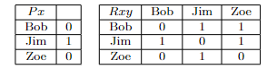

# Predicate Logic Practice Problems

## Part A

Using the following symbolization key:

- $Sxy$: $x$ is a child of $y$
- $Pxy$: $x$ is a parent of $y$
- $Mx$: $x$ is a mother
- $Fx$: $x$ is a father
- $d$: David
- $k$: Kit

translate the following sentences into predicate logic:

1. David is a parent of Kit and Kit is the child of David.
2. Kit is not a child of David but Kit is a father.
3. If Kit is a parent of David then either Kit is a mother or Kit is a father.
4. Every mother is a parent of someone.
5. Everyone is a child of a father.
6. There are mothers which are not fathers.
7. Every child of David is a father.
8. For every child of David, there is a parent of that child who is a mother.
9. Kit has a parent who is neither a mother nor a father.
10. Kit is a mother and if Kit has a child then that child is a father.

## Part B

Using the following symbolization key:

- $Ax$: $x$ is an animal
- $Gx$: $x$ is an alligator
- $Mx$: $x$ is a monkey
- $Rx$: $x$ is a reptile
- $Zx$: $x$ lives at the zoo
- $Lxy$: $x$ likes $y$
- $a$: Alfred
- $b$: Bertrand
- $c$: Charles

translate the following sentences into predicate logic:

1. Alfred, Bertrand and Charles live at the zoo.
2. Bertrand is a reptile, but not an alligator.
3. If Charles likes Bertrand then Bertrand is a monkey.
4. If both Bertrand and Charles are alligators, then Alfred likes them both.
5. Every animal at the zoo is either a monkey or an alligator.
6. Some reptiles live at the zoo.
7. Every alligator is a reptile.
8. There are reptiles which are not alligators.
9. Bertrand likes all monkeys that live at the zoo.
10. Every monkey that Charles likes, is also liked by Alfred.

## Part C

Using the following symbolization key:

- $Exy$: $x$ is to the east of $y$
- $Nxy$: $x$ is to the north of $y$
- $Tx$: $x$ is a town
- $Mx$: $x$ is a metropolis
- $h$: Hong Kong
- $p$: Paris
- $l$: Los Angeles
- $n$: New York
- $a$: Antarctic

translate the following formulas into English:

1. $(Nnl \& Enl)$
2. $(\sim Nhp \& \sim Epn)$
3. $\forall x(Mx \supset Nxa)$
4. $\exists x(Tx \& Nxn)$
5. $\forall x(Tx \& Exl)$
6. $\exists x(Mx \& Nnx)$
7. $\forall x(Mx \supset (Nxp \lor Epx))$
8. $\forall x(Tx \supset \forall y( Nyx \supset Eny))$
9. $\exists x(Mx \& \forall y(Ty \supset \sim Nyx))$

## Part D

Let:

- $b$: Bob
- $j$: Jim
- $z$: Zoe

and consider the following model:

Evaluate the following formulas for truth or falsity:

1. $Pb$
2. $Rbz$
3. $(Pb \lor Rbz)$
4. $((\sim Pb \& Rbz) \equiv Rjz)$
5. $\sim (Pj \supset Rzz)$
6. $((Pb \lor Pj) \supset (Rbj \& Rzj))$
7. $(Pj \supset (Rbb \supset Rjj))$
8. $\exists x(Px \& \exists y (Rxy))$
9. $\forall x \sim (Rxx)$
10. $\forall x (Px \supset Rxz)$

## Solutions

Part A:

1. $(Pdk \& Skd)$
2. $(\sim Skd \& Fk)$
3. $(Pkd \supset (Mk \lor Fk))$
4. $\forall x(Mx \supset \exists y (Pxy))$
5. $\forall x\exists y (Sxy \& Fy)$
6. $\exists x(Mx \& \sim Fx)$
7. $\forall x(Sxd \supset Fx)$
8. $\forall x(Sxd \supset \exists y(Pyx \& My))$
9. $\exists x(Pxk \& \sim(Mx \lor Fx))$
10. $(Mk \& (\exists x (Sxk \supset Fx))$

Part B:

1. $(Za \& Zb \& Zc)$
2. $(Rb \& \sim Gb)$
3. $(Lcb \supset Mb)$
4. $((Gb \& Gc) \supset (Lab \& Lac))$
5. $\forall x((Ax \& Zx) \supset (Mx \lor Gx))$
6. $\exists x(Rx \& Zx)$
7. $\forall x(Gx \supset Rx)$
8. $\exists x(Rx \& \sim Gx)$
9. $\forall x((Mx \& Zx) \supset Lbx)$
10. $\forall x((Mx \& Lcx) \supset Lax)$

Part C:

1. New York is north of and east of Los Angeles.
2. Hong Kong is not north of Paris and Paris is not east of New York.
3. All metropolises are north of Antarctica.
4. There is a town north of New York.
5. Everything is a town east of London.
6. New York is north of some metropolis.
7. All metropolises are either north of Paris or to the east of Paris.
8. New York is east of everything north of every town. 
9. There is a metropolis such that all towns are not north of that metropolis.

Part D:

1. False
2. True
3. True
4. True
5. True
6. True
7. True
8. True
9. True
10. True