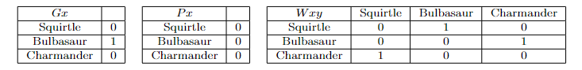

# Semantics for Quantified Formulas

What follows will only make sense if you already know how to evaluate formulas in predicate logic without quantifiers in them. We shall begin by considering the semantics for quantified formulas:

- $(\forall x)A$ is true iff $A(x:=a)$ is true for all objects $a$ in the domain $D$.
- $(\exists x)A$ is true iff $A(x:=a)$ is true for some object $a$ in the domain $D$.

where $A$ is just a variable (i.e., a place-holder) for any formula in predicate logic and $A(x:=a)$ is just the formula $A$ but with all the occurrences of $x$ replaced with $a$ (note that the choice of using $A$ and $a$ here is arbitrary; I could have written the condition in terms of $B$ and $c$). We shall consider a working example throughout this section. Consider the following model:

Here, we have two monadic predicates $G$ and $P$ and one dyadic predicate $W$. We also have a domain of three objects $D = \{\text{Squirtle, Bulbasuar, Charmander}\}$. Let us suppose that there are no names in our language.

## Existentials

Let us start with existential formulas first and see how to evaluate them.

1. Consider $(\exists x)(Gx)$. The semantics tells us that: $(\exists x)(Gx)$ is true iff $(Gx)(x:=a)$ is true for some object $a$ in the domain $D$. This just means that if there is an object in the domain and we substitute in for $x$ a name of this object and we end up with a true formula, then the existential formula is true. In our toy model, we only have three objects so we can check whether or not there is such an object by brute force:

-  Consider Squirtle. We do not have a name for Squirtle yet in our language, so let us just use $s$ as a name for Squirtle. Then we want to know whether or not $(Gx) (x := s)$ is true. $(Gx)(x:=s)$ is just $Gs$. And we see that under the $Gx$ table, the row for the object denoted by $s$ (namely, Squirtle) has a $0$. Therefore, $(Gx) (x:=s)$ is false.
- Consider Bulbasaur. We don't have a name for Bulbasaur yet in our language, so let us introduce $b$ as a name for Bulbasaur.  We want to know whether or not $(Gx)(x:= b)$ is true. $(Gx)(x:=b)$ is just $Gb$. And we see that under the $Gx$ table, the row for the object denoted by $b$ (namely, Bulbasaur) has a 1. Therefore, $(Gx)(x:=b)$ is true.

This last condition with Bulbasaur reveals that there is such an object such that if we substitute in a name for that object for $x$, then we end up with a true formula. This means that the existential formula $(\exists x)(Gx)$ is true.

2. Consider $(\exists y)(Py)$. Going a bit quicker, what we are looking for is an object in the domain, such that if we put a name for that object into the $y$ position, the resulting formula is true. Simply looking at the $Px$ table, we see that there is no object that will make $Px$ true. Hence, $(\exists y)(Py)$ is false.

3. Consider $(\exists x)(\sim Px)$. Again, going quickly, we are looking for at least one object in the domain such that when we substitute in a name for that object into the $x$ position, the resulting formula is true. It turns out that $\sim Ps$ is true. Hence, $(\exists x)(\sim Px)$ is true.

4. Consider $(\exists z)(Wzs \lor Gz)$. This formula is true just in case there is some object in the domain such that when we substitute in a name for that object into the $z$ positions (notice there are two $z$ in the formula), the resulting formula is true. There are three objects and hence three formulas we need to consider (and only one of these needs to be true for the existential formula to be true):

- $(Wzs \lor Gz)(x:=s) \implies  (Wss \lor Gs) \implies 0$
- $(Wzs \lor Gz)(x:=b) \implies(Wbs \lor Gb) \implies 1$ [Can stop here]
- $(Wzs \lor Gz)(x:=c) \implies (Wcs \lor Gc)$

Hence, $\exists z)(Wzs)\lor Gz)$ is true. Note again, we need not check for every object in the domain. The moment you have found an object that will witness the truth of the existential, you know that the existential is true.

## Universals

Now let us move on to universal sentences:

1. Consider $(\forall x)(Gx)$. According to our semantical rule, $(\forall x)(Gx)$ is true iff $(Gx)(x:=a)$ is true for all objects $a$ in the domain. This means that $(\forall x)(Gx)$ is true just in case no matter which object we consider, if we replace the $x$ with a name for that object, we end up with a true formula. It also means that $(\forall x)(Gx)$ is false just in case there exists at least one object, such that if we replace $x$ with a name for that object, we end up with a false formula. In any cases, lets begin checking the cases:

- $(Gx)(x:= s) \implies Gs \implies 0$ [Can stop here]
- $(Gx)(x:= b) \implies Gb$
- $(Gx)(x:= c) \implies Gc$

We can stop immediately at the Squirtle case because it immediately shows that it is not the case that we can always replace $x$ with a name for any object. Hence, $(\forall x)(Gx)$ is false.

2. Consider $(\forall x)(\sim Px)$. Going quickly, let us consider the three cases:

- $(\sim Px)(x:=s) \implies \sim Ps \implies 1$
- $(\sim Px)(x:=b) \implies \sim Pb \implies 1$
- $(\sim Px)(x:=c) \implies \sim Pc \implies 1$

We see here that no matter which object we pick, if we substitute for $x$, a name for that object, we get a true formula. Hence, $(\forall x)(\sim Px)$ is true.

3. Consider $(\forall x)(Gx \supset Wxc)$:

- $(Gx \supset Wxc)(x:= s) \implies (Gs \supset Wsc) \implies 1$
- $(Gx \supset Wxc)(x:= b) \implies (Gb \supset Wbc) \implies 1$
- $(Gx \supset Wxc)(x:= c) \implies (Gc \supset Wcc) \implies 1$

We see that no matter what object's name we substitute in, the formula is true. Hence, $(\forall x)(Gx \supset Wxc)$ is true.

4. Consider $(\forall x)(Gx \supset Wcx)$:

- $(Gx \supset Wcx)(x:= s) \implies (Gs \supset Wcs) \implies 1$
- $(Gx \supset Wcx)(x:= b) \implies (Gb \supset Wcb) \implies 0$ [Can stop here]
- $(Gx \supset Wcx)(x:= c) \implies (Gc \supset Wcc)$

We see here that substituting in a name for Bulbasaur in for $x$ results in a false formula. Hence, $(\forall x) (Gx \supset Wcx)$ is false.

## Multiple Quantifiers

Now we consider formulas with multiple quantifiers. The idea is exactly the same, but now you need to do a lot of book keeping:

1. Consider $(\forall x)((\exists y)(Wxy))$:

- $((\exists y)(Wxy)))(x:=s) \implies (\exists y)(Wsy)$
    - $(Wsy)(y:=s) \implies Wss \implies 0$
    - $(Wsy)(y:=b) \implies Wsb \implies 1$ [Can stop here: $((\exists y)(Wxy))(x:=s) \implies 1$] 
- $((\exists y)(Wxy)))(x:=b) \implies (\exists y)(Wby)$
    - $(Wby)(y:=s) \implies Wbs \implies 0$
    - $(Wby)(y:=b) \implies Wbb \implies 0$
    - $(Wby)(y:=c) \implies Wbc \implies 1$ [Must stop here: $((\exists y)(Wxy))(x:=b) \implies 1$]
- $((\exists y)(Wxy)))(x:=c) \implies (\exists y)(Wcy)$
    - $(Wcy)(y:=s) \implies Wcs \implies 1$ [Can stop here: $((\exists y)(Wxy))(x:= c) \implies 1$]$ 
    

So, we get that no matter what object we choose for $x$, the resulting existential formula is true. Therefore, $\forall x\exists y (Wxy)$ is true.

2. Consider $(\exists x)((\forall y)(Wyx))$:

- $((\forall y)(Wxy))(x:= s) \implies (\forall y)(Wys)$
    - $(Wys)(y:=s) \implies Wss \implies 0$ [Can Stop Here: $((\forall y)(Wyx))(x:=s) \implies 0$]
- $((\forall y)(Wyx))(x:=b) \implies (\forall y)(Wyb)$
    - $(Wyb)(y:=s) \implies Wsb \implies 1$
    - $(Wyb)(y:=b) \implies Wbb \implies 0$ [Can stop here: $((\forall y)(Wyx))(x:=b) \implies 0$
]
    
- $((\forall y)(Wyx))(x:=c) \implies (\forall y)(Wyc)$
    - $(Wyc)(y:=s) \implies Wsc \implies 0$ [Can Stop here: $((\forall y)(Wyx))(x:=c) \implies 0$] 

So, there is no object that makes the resulting universal formula true. Therefore, $\exists x\forall y(Wyx)$ is false.

## Practice Problem:

Consider the model:

$$
I(F) = \{\langle 0,1\rangle, \langle 1,0\rangle, \langle 1,2\rangle, \langle 2,1\rangle, \langle 2,3,\rangle, \langle 3,2\rangle, \langle 3,4\rangle, \langle 4,3\rangle \}
$$
$$
I(L) = \{\langle 1,0,1\rangle, \langle 1,2,3\rangle,\langle 1,3,4\rangle\}
$$
Which of the following formulas are true?

1. $\forall x(\exists y (Fxy))$
2. $\forall x (\forall y (Fxy \supset Fyx))$
3. $\forall x (Fxx \supset Lxxx)$
4. $\exists x \forall y \forall z(Lxyz)$
5. $\sim \forall x \forall y (Lxyx \equiv Lyxy)$

## Solution

1. T
2. T
3. T
4. F
5. F
